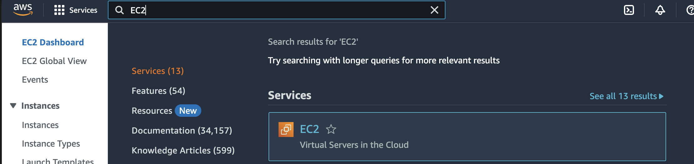
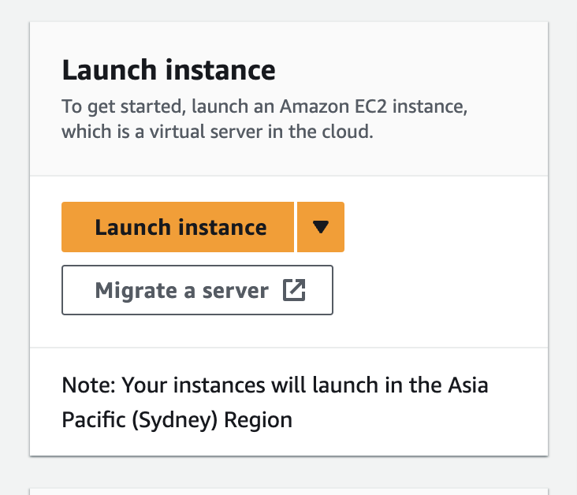
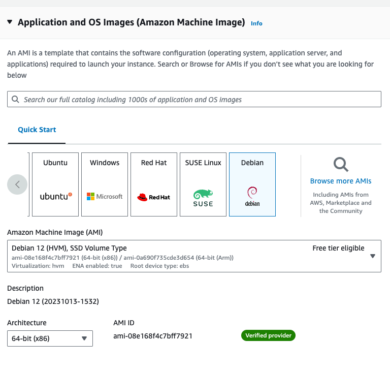
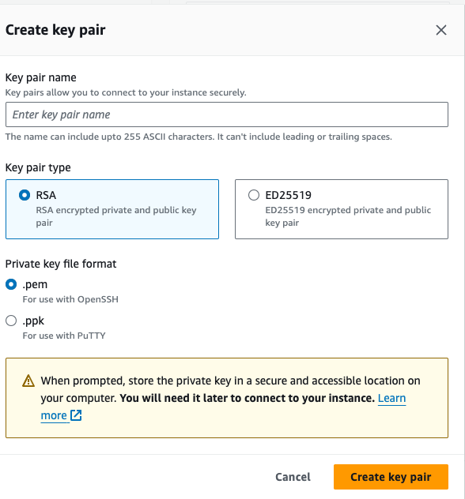
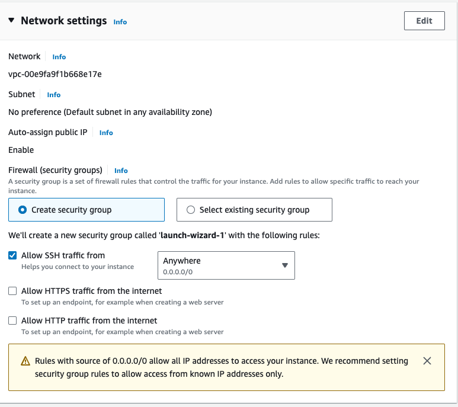
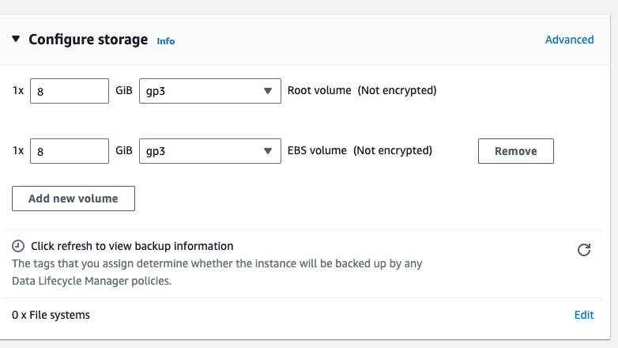

# project-aws-ec2-trading-bot

This is the repo on setting up a demo trading bot to execute custom trading strategy on Bybit

## Setting Up EC2

1. Search for EC2 at the search bar and select it
   

2. Select Launch Intstance
   

3. Select your desired OS. In here Ubuntu was selected for its beginner friendlyness, and also it seems like only Amazon Linux and Ubuntu supports cloud shell
   

4. Generate a keypair to SSH into the EC2 instance from your own machine. Store the .pem file in a secure place
   

   - Change the permissions of the .pem file to make sure only owner can access it, and wouldnt be modified

   - Connect EC2 via SSH

     ```shell
     chmod 400 /path/to/your-key.pem
     ```

     ```shell
     ssh -i /path/to/your-key.pem     ec2-user@your-instance-public-dns-name
     ```

5. Configure network to allow access. Since this is a demo, we allow access from anywhere as long as the person has the key. Since we are not creating a frontend server, we are disallowing HTTP and HTTPS access

   

6. Select storage -> by default it provides an 8GB EBS volume
   

## Install Required Software on EC2

1. Update Instance

   ```shell
   sudo apt update
   sudo apt upgrade -y
   ```

2. Install NodeJs and NPM

   ```shell
   sudo apt install nodejs
   sudo apt install npm
   ```

3. Install git to interact with github

   ```shell
   sudo apt install git
   ```
